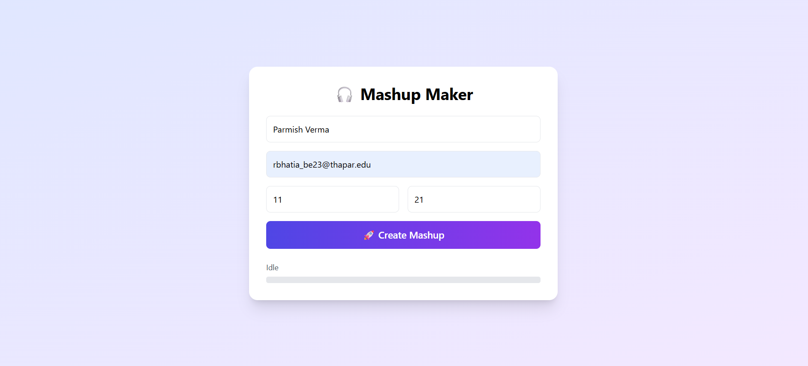
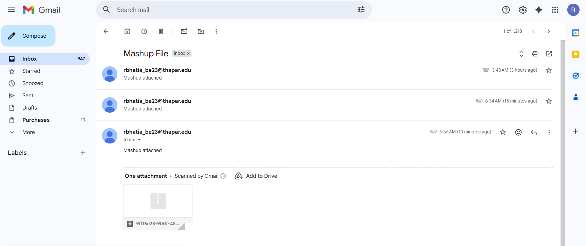

# Mashup Audio Generator & Web Service

This project is developed as part of **UCS654 – Predictive Statistics Assignment**.

It contains:

-  **Program 1:** Command-line Mashup Generator  
-  **Program 2:** Web-based Mashup Service (Flask) with Email Delivery  

---

#  Project Structure

```
Mashup_Assignment_7/
│── 102317171.py        # Program 1 (CLI mashup generator)
│── mashup_module.py    # Core mashup logic
│── app.py              # Flask web service backend
│── templates/
│   └── index.html      # Web UI
│── outputs/            # Generated mashups (ignored in git)
│── README.md
│── requirements.txt
│── render.yaml
│── Procfile
│── Dockerfile
│── .env                # SMTP credentials (NOT pushed to GitHub)

```

---

# Requirements

Install required Python libraries:

```bash
pip install -r requirements.txt
```

Also install:

- **FFmpeg** (must be added to system PATH)

Check FFmpeg installation:

```bash
ffmpeg -version
```

---


# How to Run (Program 1 – Command Line)

```bash
python 102317171.py "Parmish Verma" 11 21 test.mp3
```
Parameters:
   - Singer Name
   - Number of Videos (>10)
   - Duration (>20 seconds)
   - Output file name
---

# How to Run (Program 2 – Web App)

Run the Flask server:

```bash
python app.py
```

Then open in browser:

```
http://127.0.0.1:5000
```

Fill the form and click **Create Mashup**.


User Inputs
   - Singer Name
   - Email Address
   - Number of Videos (must be greater than 10)
   - Duration (must be greater than 20 seconds)


System Workflow
   - After submission, the system:
   - Searches YouTube videos.
   - Downloads best audio streams.
   - Trims clips to required duration.
   - Merges all clips into a mashup.
   - Creates a ZIP file.
   - Sends the ZIP automatically to the user's email.

---

# Email Feature

- Uses **Gmail SMTP**
- Uses **Google App Password**
- Automatically sends **ZIP file** containing mashup to user's email

---

# Example Input

- **Singer Name:** Parmish Verma
- **Number of Videos:** 11
- **Duration:** 21 seconds  
- **Email:** yourmail@gmail.com  

---

# Output

- `test.mp3` → Generated mashup file  
- `result.zip` → Sent to user's email  

---

## Web Interface

> Mashup Generator Web UI:



---

## Email Received Output

> Mashup ZIP received on email:




# Important Notes

- FFmpeg must be properly installed and added to PATH  
- Internet connection required for YouTube download  
- Gmail **App Password** must be configured in `app.py`  
- Do NOT use your normal Gmail password  

---